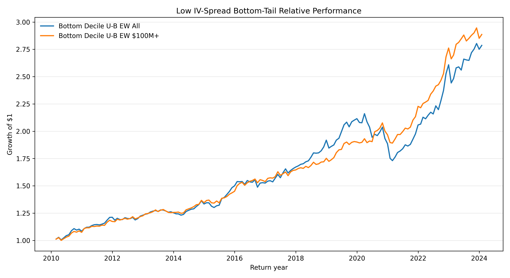

# Option-Implied Signals and Bottom-Tail Equity Underperformance

This repository contains the public research code and reproducibility workflow for a project on whether option-implied volatility surfaces predict future stock returns.

The main signal is:

```text
IV spread = 30-day ATM call implied volatility - 30-day ATM put implied volatility
```

The final sample covers U.S. optionable stocks with 2010-2023 signals and 2010-02 through 2024-01 forward returns. The analysis uses OptionMetrics volatility surface data, CRSP daily and monthly stock returns, the WRDS CRSP-OptionMetrics historical link, and Fama-French factor data.

## Main Finding

Stocks in the lowest IV-spread tail underperform the broader optionable-stock universe. The result is strongest as a bottom-tail negative-selection signal rather than a symmetric ranking factor.

| Strategy | Annualized return | Sharpe | Newey-West t-stat | FF5+MOM alpha | Alpha t-stat |
|---|---:|---:|---:|---:|---:|
| Bottom Decile U-B EW All | 7.57% | 1.11 | 4.00 | 6.40% | 5.07 |
| Bottom Decile U-B EW $100M+ | 7.73% | 1.49 | 5.87 | 6.29% | 5.85 |

Note: U-B means “Universe minus Bottom.” It is the return of the full optionable-stock universe minus the return of the lowest IV-spread tail. A positive U-B return means the bottom IV-spread group underperformed the broader universe.



*Figure: Cumulative performance of the main IV-spread bottom-tail strategy from the public results pack.*

The long-only exclusion screen is more practical than the direct long-short portfolio. Excluding the bottom IV-spread decile improves the equal-weighted universe by about 0.84% annually for all stocks and about 0.86% annually for the $100M+ universe, with much lower turnover than a standalone long-short implementation.

## Interpretation

The evidence is consistent with low call-minus-put implied volatility identifying stocks with subsequent underperformance. The result is not a clean monotonic factor: the top IV-spread decile does not strongly outperform the universe. The practical interpretation is therefore negative selection: avoiding or underweighting the lowest IV-spread names can improve a long-only optionable-stock portfolio, while a high-turnover long-short implementation requires substantial transaction-cost caution.

All return and alpha results are gross of trading costs unless explicitly stated.

## Repository Structure

```text
src/                         Reusable research functions
scripts/public/              Final public standalone pipeline scripts
docs/                        Research paper and pipeline documentation
data/                        Local licensed data caches, ignored by Git
outputs/public_2010_2023/    Curated public final outputs plus ignored diagnostics
```

The public workflow is contained in `scripts/public/`.

## Public Pipeline

The public pipeline is organized as a readable sequence:

| Step | Script | Purpose |
|---:|---|---|
| 00 | `scripts/public/00_check_environment.py` | Check packages, folders, expected files, and optional WRDS connectivity |
| 01 | `scripts/public/01_pull_data.py` | Cache-first raw data preparation; contacts WRDS only with explicit flags |
| 02 | `scripts/public/02_build_option_signals.py` | Build daily IV signals and daily VRP panel from cached local data |
| 03 | `scripts/public/03_build_monthly_panel.py` | Build the 2010-2023 monthly signal panel |
| 04 | `scripts/public/04_run_main_results.py` | Run main decile, quintile, and bottom-tail portfolio results |
| 05 | `scripts/public/05_run_factor_regressions.py` | Run CAPM, FF3, FF5, and FF5+MOM regressions |
| 06 | `scripts/public/06_run_long_only_exclusion.py` | Run the long-only exclusion screen analysis |
| 07 | `scripts/public/07_run_robustness_checks.py` | Run robustness and interpretation analyses |
| 08 | `scripts/public/08_create_final_outputs.py` | Create curated final tables, figures, and results pack |
| 09 | `scripts/public/09_audit_results.py` | Audit public outputs and key cached inputs |

`scripts/public/run_public_analysis.py` runs the processed-panel-to-results workflow: steps 00, 04, 05, 06, 07, 08, and 09. It intentionally does not run raw-data pulls or rebuild processed panels.

## How To Run

A fresh GitHub clone intentionally does not include raw or processed licensed data. You can still inspect the code, curated final tables, final figures, final results pack, and paper documents. Rebuilding the empirical pipeline requires WRDS, OptionMetrics, and CRSP access. Most readers should start by reviewing the final outputs; full reruns require licensed data access.

Create and activate a virtual environment, then install dependencies:

```bash
python -m venv .venv
source .venv/bin/activate
pip install -r requirements.txt
```

Run an environment check:

```bash
python scripts/public/00_check_environment.py
```

Check raw-data caches without connecting to WRDS:

```bash
python scripts/public/01_pull_data.py --check-cache-only
```

In a fresh public clone, this cache check is expected to warn that local data are missing. That is normal.

Preview the public analysis runner:

```bash
python scripts/public/run_public_analysis.py --check-only
```

Run from processed panel to final outputs:

```bash
python scripts/public/run_public_analysis.py
```

This command requires `data/processed/monthly_signal_panel_2010_2023.parquet`. If the processed panel is missing, the runner exits early with instructions instead of failing on development-only outputs.

Run individual scripts as needed:

```bash
python scripts/public/04_run_main_results.py
python scripts/public/05_run_factor_regressions.py
python scripts/public/06_run_long_only_exclusion.py
python scripts/public/07_run_robustness_checks.py
python scripts/public/08_create_final_outputs.py
python scripts/public/09_audit_results.py
```

To rebuild the full local pipeline from raw licensed data, first use the cache-first data script with explicit WRDS permission:

```bash
python scripts/public/01_pull_data.py --allow-wrds
python scripts/public/02_build_option_signals.py
python scripts/public/03_build_monthly_panel.py
python scripts/public/run_public_analysis.py
```

`--force-pull` is available but intentionally requires `--allow-wrds`.

Without licensed data access, review these public artifacts instead:

- this `README.md`
- code in `src/` and `scripts/public/`
- `outputs/public_2010_2023/final_results_pack.md`
- `outputs/public_2010_2023/final_tables/`
- `outputs/public_2010_2023/final_figures/`
- research paper files in `docs/`, if included

## Data Access And Licensing

Raw OptionMetrics, CRSP, and WRDS data are not included in this repository. Large processed Parquet files are also excluded.

Full local reproduction requires access to:

- OptionMetrics IvyDB volatility surface tables
- CRSP daily and monthly stock returns
- WRDS CRSP-OptionMetrics historical link table
- Fama-French 5-factor and momentum factor CSV files

The local data files created during reproduction are documented in [data/README.md](data/README.md). Users with WRDS access can regenerate local caches with `scripts/public/01_pull_data.py --allow-wrds`; credentials are handled by the standard `wrds` package and are never stored by this project.

## Key Outputs

Curated public outputs are:

- [outputs/public_2010_2023/final_results_pack.md](outputs/public_2010_2023/final_results_pack.md)
- [outputs/public_2010_2023/final_tables/](outputs/public_2010_2023/final_tables/)
- [outputs/public_2010_2023/final_figures/](outputs/public_2010_2023/final_figures/)
- [docs/research_paper_final_with_extensions.docx](docs/research_paper_final_with_extensions.docx), if included in the public repository

Bulk diagnostic tables and charts are regenerated locally and ignored by Git.

## Robustness Checks

The public pipeline includes:

- FF5+MOM factor regressions
- value-weighted portfolios
- market-cap filtered universes
- subperiods, including the 2018-2019 and 2020 split
- holding-period decay
- newly-bottom versus persistent-bottom tests
- outlier robustness for stock returns and the IV-spread signal
- long-only exclusion turnover and transaction-cost sensitivity
- signal-extension checks around changes, persistence, and put-pressure variants

## Limitations

- Long-short returns are gross of transaction costs and the direct long-short strategy has high turnover.
- Results depend on licensed OptionMetrics, CRSP, and WRDS data.
- The tests do not prove a causal private-information channel.
- The signal is strongest as a bottom-tail exclusion or underweighting screen, not as a symmetric long-short sentiment factor.

## Reproducibility Status

The public standalone scripts were validated against the original research outputs. Key public comparisons passed with no discrepancies:

- daily IV and VRP construction: 31 comparison checks passed
- monthly panel construction: 23 comparison checks passed
- factor regressions: 32 comparison checks passed
- long-only exclusion: 62 comparison checks passed
- robustness outputs: 86 comparison checks passed
- public audit: 67 PASS, 0 WARN, 0 FAIL

## Author

Thibault Eelen
